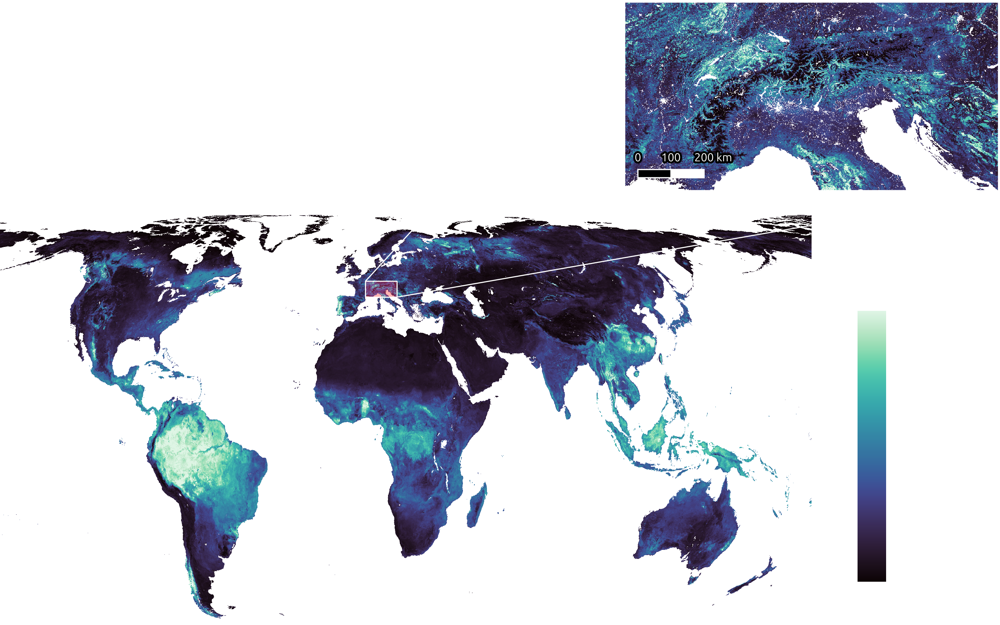
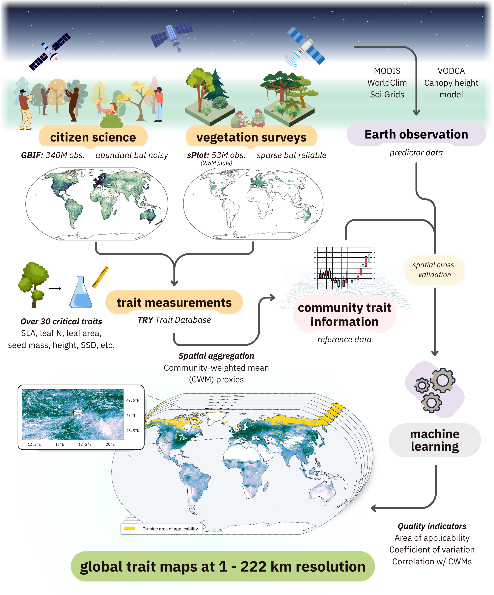

# Global plant trait maps based on crowdsourced biodiversity monitoring and Earth observation



## Project Overview
This project generates global, high-resolution plant trait maps based on crowdsourced biodiversity monitoring and Earth observation. The maps cover 31 plant functional traits as defined in the TRY Plant Trait Database at 1 km resolution with global extent.

Plant functional traits are predicted as community-weighted means based on a synthesis of crowdsourced biodiversity data (GBIF species observations, sPlot vegetation surveys, and in situ trait measurements from the TRY trait database) modeled as a function of Earth observation data, including surface reflectance, climatic variables, soil properties, canopy height, and vegetation optical depth.

* [**Online data viewer**](https://global-traits.projects.earthengine.app/view/global-traits)
* [**Download the data**](https://zenodo.org/records/14646322)
* [**Project page**](https://geosense-freiburg.github.io/global-traits/)




## Project organization
    ├── LICENSE
    ├── README.md                    <- The top-level README for developers using this
    │                                   project.
    ├── data
    │   ├── external                 <- Data from third party sources.
    │   ├── interim                  <- Intermediate data that has been transformed.
    │   ├── processed                <- The final, canonical data sets for modeling.
    │   └── raw                      <- The original, immutable data dump.
    │
    ├── notebooks                    <- Jupyter notebooks. Naming convention is a number
    │                                   (for ordering), the creator's initials, and a
    │                                   short `-` delimited description, e.g.
    │                                   `1-0_jqp_initial-data-exploration`.
    │
    ├── references                   <- Data dictionaries, manuals, and all other
    │                                   explanatory materials.
    │
    ├── reports                      <- Generated analysis as HTML, PDF, LaTeX, etc.
    │   └── figures                  <- Generated graphics and figures to be used in reporting
    │
    ├── setup.py                     <- makes project pip installable (pip install -e .)
    │                                   so src can be imported
    ├── src                          <- Source code for use in this project.
    │   ├── __init__.py              <- Makes src a Python module
    │   │
    │   ├── data                     <- Scripts to download or generate data
    │   │
    │   ├── features                 <- Scripts to turn raw or interim data into features for modeling
    │   │
    │   └── visualization            <- Scripts to create exploratory and results oriented visualizations
    │       └── visualize.py
    ├── tests                        <- Unit tests for use with `pytest`
    │
    ├── pyproject.toml               <- Human-readable project dependencies managed with
    │                                   Poetry
    ├── poetry.lock                  <- File used by Poetry to install dependencies
    ├── conda-linux-64.lock          <- File used by conda-lock to install dependencies for 64-bit Linux systems
    ├── environment.yml              <- File used by conda-lock to specify dependencies
    ├── dvc.yml                      <- DVC pipeline definitions
    ├── params.yml                   <- DVC parameter definitions. **IMPORTANT: this project**
    │                                   **also uses this file as a config file (see src.conf.parse_params)**
    ├── dvc.lock                     <- DVC file which tracks changes to data tracked by DVC
    └── .pre-commit-config.yaml      <- pre-commit Git hooks


## How to reproduce
This project uses Data Version Control (DVC) to manage data dependencies and pipeline execution. To reproduce the full workflow:

1. Clone the repository
    ```shell
    git clone https://github.com/GeoSense-Freiburg/cit-sci-traits.git
    cd cit-sci-traits
    ```

1. Install dependencies (using conda or poetry as preferred)
    ```shell
    # Using conda
    conda env create -f environment.yml
    conda activate cit-sci-traits

    # OR using poetry
    poetry install
    ```

1. Install DVC for pipeline reproduction
    ```shell
    pipx install dvc
    ```

1. Pull the data dependencies using DVC (requires collaborative setup: contact daniel.lusk[at]geosense.uni-freiburg.de for more information)
    ```shell
    dvc pull
    ```

1. Reproduce the entire pipeline
    ```shell
    dvc repro
    ```

    Or run specific pipeline stages:
    ```shell
    dvc repro <stage-name>
    ```

For more detailed information on DVC commands, see the [DVC documentation](https://dvc.org/doc/command-reference).

## Data used
### Predictor data
The predictor data used for this experiment is all open source. See https://github.com/GeoSense-Freiburg/panops-data-registry for the exact Google Earth Engine scripts used to retrieve the predictor data.

### Trait data
Similarly, the TRY trait data is also available for download via https://trydb.org. See params.yaml or the table below for a list of traits used.

### GBIF species observations
GBIF observations are also freely available. See https://github.com/GeoSense-Freiburg/panops-data-registry/references/gbif/query_all_tracheophyta.json for the exact query used in this experiment, as well as https://github.com/GeoSense-Freiburg/panops-data-registry/src/gbif/get_gbif_data.py for the download script.

### sPlot vegetation surveys
sPlot vegetation data was obtained with express permission from the [sPlot consortium](https://www.idiv.de/research/projects/splot/). For an open-access version of sPlot data, [sPlotOpen](https://onlinelibrary.wiley.com/doi/10.1111/geb.13346) can be used.

### Trait table
| Trait | TRY trait name | TRY ID | Unit |
|-------|---------------|--------|------|
| Conduit element length | Wood vessel element length; stem conduit (vessel and tracheids) element length | 282 | µm |
| Dispersal unit length | Dispersal unit length | 237 | mm |
| LDMC | Leaf dry mass per leaf fresh mass (leaf dry matter content, LDMC) | 47 | g g-1 |
| Leaf area | Leaf area (in case of compound leaves: leaflet, undefined if petiole is in- or excluded) | 3113 | mm² |
| Leaf C | Leaf carbon (C) content per leaf dry mass | 13 | mg g-1 |
| Leaf C/N ratio | Leaf carbon/nitrogen (C/N) ratio | 146 | g g-1 |
| Leaf delta 15N | Leaf nitrogen (N) isotope signature (delta 15N) | 78 | ppm |
| Leaf dry mass | Leaf dry mass (single leaf) | 55 | g |
| Leaf fresh mass | Leaf fresh mass | 163 | g |
| Leaf length | Leaf length | 144 | mm |
| Leaf N (area) | Leaf nitrogen (N) content per leaf area | 50 | g m-2 |
| Leaf N (mass) | Leaf nitrogen (N) content per leaf dry mass | 14 | mg g-1 |
| Leaf P | Leaf phosphorus (P) content per leaf dry mass | 15 | mg g-1 |
| Leaf thickness | Leaf thickness | 46 | mm |
| Leaf water content | Leaf water content per leaf dry mass (not saturated) | 3120 | g g-1 |
| Leaf width | Leaf width | 145 | mm |
| Plant height | Plant height (vegetative) | 3106 | m |
| Rooting depth | Root rooting depth | 6 | m |
| Seed germination rate | Seed germination rate (germination efficiency) | 95 | days |
| Seed length | Seed length | 27 | mm |
| Seed mass | Seed dry mass | 26 | mg |
| Seed number | Seed number per reproduction unit | 138 | - |
| SLA | Leaf area per leaf dry mass (specific leaf area, SLA or 1/LMA): undefined if petiole is in- or excluded) | 3117 | m² kg-1 |
| SRL | Root length per root dry mass (specific root length, SRL) | 1080 | cm g-1 |
| SRL (fine) | Fine root length per fine root dry mass (specific fine root length, SRL) | 614 | cm g-1 |
| SSD | Stem specific density (SSD) or wood density (stem dry mass per stem fresh volume) | 4 | g cm-3 |
| Stem conduit density | Stem conduit density (vessels and tracheids) | 169 | mm-2 |
| Stem conduit diameter | Stem conduit diameter (vessels, tracheids) | 281 | µm |
| Stem diameter | Stem diameter | 21 | m |
| Wood fiber lengths | Wood fiber lengths | 289 | µm |
| Wood ray density | Wood rays per millimetre (wood ray density) | 297 | mm-1 |


More information on the PANOPS project is available at:

https://uni-freiburg.de/enr-geosense/research/panops/
https://gepris-extern.dfg.de/gepris/projekt/504978936?language=en
Project Organization